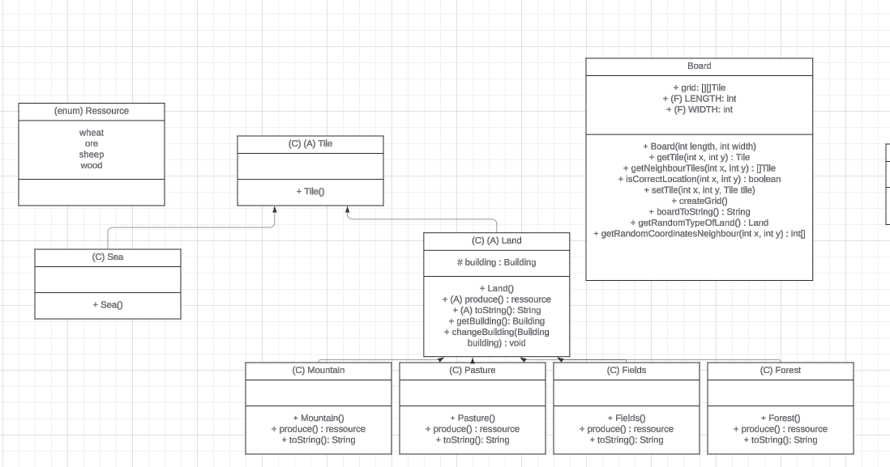
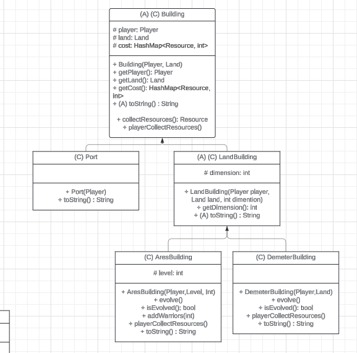
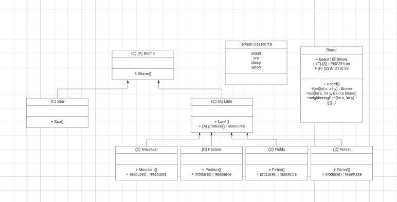

# l2s4-projet-2025

Vous devez *forker* ce projet dans votre espace de travail Gitlab (bouton `Fork`) et vidéo sur le [portail](https://www.fil.univ-lille.fr/portail/index.php?dipl=L&sem=S4&ue=Projet&label=Documents)
Un unique fork doit être réalisé par équipe.

Une fois cela réalisé, supprimer ces premières lignes et remplissez les noms des membres de votre équipe.
N'oubliez pas d'ajouter les autres membres de votre équipe aux membres du projet, ainsi que votre enseignant·e (statut Maintainer).

# Equipe

- Rémi ANDRIEU
- Samuel DEMON
- Tom TAFFIN
- Andreï CHARONOV

# Sujet

[Le sujet 2025](https://www.fil.univ-lille.fr/~varre/portail/l2s4-projet/sujet2025.pdf)

# Livrables

Les paragraphes concernant les livrables doivent être rempli avant la date de rendu du livrable. A chaque fois on décrira l'état du projet par rapport aux objectifs du livrable. Il est attendu un texte de plusieurs lignes qui explique la modélisation choisie, et/ou les algorithmes choisis et/ou les modifications apportées à la modélisation du livrable précédent.

Un lien vers une image de l'UML doit être fourni (une photo d'un diagramme UML fait à la main est suffisant).

## Livrable 1

### Atteinte des objectifs

La génération du plateau se fait selon la méthode suivante. Tout d'abord les dimensions du plateau sont choisies à sa construction. Puis une grille remplie de tuiles mer est générée. Ensuite on détermine aléatoirement le nombre de tuiles terrain à générer entre 1/4 et 1/3 pour respecter la condition d'au moins 2/3 de mer. Ensuite tant qu'il reste des tuiles terrain à poser, on se positionne sur une tuile aléatoirement et si c'est une tuile mer, on la change en terrain aléatoirement. Puis si elle est entourée que de mer, on génère un autre terrain à côté aléatoirement. Puis si il reste des tuiles à placer, on a une probabilité p de poursuivre la génération à partir de l'ancienne tuile générée. Sinon recommence le processus. Cette probabilité p peut être mofifiée afin de générer plus ou moins d'îles de taille plus ou moins grande. La génération du plateau est instantanée pour un plateau de 1000 par 1000.

Les ressources ont été implémentées avec un enum car chaque joueur aura une hashmap avec les ressources en clé et leurs quantités en valeur.

La classe abstraite tile représente l'ensemble des tuiles. La classe abstraite Land représente les terrains qui produisent une ressource, la méthode produce renvoie la ressource associée au terrain et la méthode toString permet l'affichage correct du plateau.
Le board possède un tableau à deux dimensions de tuiles pour le plateau. Pour générer le plateau il faut appeler la méthode createGrid(). Board possède aussi d'autres méthodes utilisées dans createGrid et qui pourront aussi servir par la suite.

Presque toutes les classes n'ont pas été testées car elles ne possèdent pas de méthodes ou uniquement des méthodes triviales. De même pour quelques méthodes de Board qui sont triviales.

____

#### UML:


____

#### commandes

Pour générer la documentation :  
```javadoc -sourcepath ./src -d ./docs -subpackages game game.board game.board.util```

Pour consulter la documentation, ouvrez `index.html` situé dans le dossier `docs`

Pour compiler :
```javac -sourcepath src src/game/board/*.java -d classes```
```javac -sourcepath src src/game/board/util/*.java -d classes```


Pour créer un jar exécutable `livrable1.jar` :
```jar cvfe livrable1.jar game.board.Livrable1 -C classes game```

Pour exécuter `livrable1.jar` :
```java -jar livrable1.jar```


Pour compiler et exécuter les tests :  
```javac -classpath junit-console.jar:classes -sourcepath test test/game/board/*.java && java -jar junit-console.jar -classpath test:classes -scan-classpath```


### Difficultés restant à résoudre

Nous n'avons pas trouvé de moyen pour que si un nouveau type de terrain est ajouté, le choix du terrain inclu ce nouveau terrain. La méthode getRandomTypeOfLand devra donc être modifiée. Le choix d'un voisin mer aléatoirement n'est pas très efficace, nous reviendrons peut-être sur son implémentation.

## Livrable 2

### Atteinte des objectifs

La classe abstraite Building représente l'ensemble des bâtiments.
Un building est caractérisé par le joueur possédant ce building, la case sur laquelle est implémenté ce building et son coût de création.  
La classe Port hérite de la classe Building. Elle permet de représenter un port. Quand le jeu sera implémenté, un port ne pourra être posé qu'à côté d'une case Sea.
La classe LandBuilding hérite de la classe Building. Elle possède un attribut supplémentaire : sa dimension. 
La méthode collectRessources récupère la ressource associée à la case de ce bâtiment, et la méthode playerCollectRessources ajoute cette ressource aux ressources possédées par le joueur.  
Les classes AresBuilding et DemeterBuilding représentent les batiments des différents jeux.  
Pour DemeterBuilding : un batiment de dimension 1 représente une ferme et un batiment de dimension 2 représente une exploitation.  
Pour AresBuilding : la dimension du batiment correspond aux nombre de guerriers. Une armée évolue en camp à partir de 6 guerriers ou en utilisant des ressources.
Dans ces deux classes, la méthode evolve permet de faire évoluer le batiment, isEvolved permet de savoir si un batiment est évolué, et playerCollectRessources collecte la ressource (2 fois si le batiment est évolué, 1 fois sinon).  
La méthode addWarriors de la classe AresBuilding ajoute le nombre de guerriers passé en paramètre.  
Dans la classe Land, un attribut building indique le bâtiment présent sur la case, et la méthode changeBuilding permet de changer le bâtiment.
____

#### UML:






____

#### commandes

Pour générer la documentation :  
```javadoc -sourcepath ./src -d ./docs -subpackages game game.board game.board.util game.player game.building```

Pour consulter la documentation, ouvrez `index.html` situé dans le dossier `docs`

Pour compiler :
```javac -sourcepath src src/game/building/*.java src/game/player/*.java src/game/board/*.java src/game/board/util/*.java -d classes```


Pour créer un jar exécutable `livrable2.jar` :
```jar cvfe livrable2.jar game.building.Livrable2 -C classes game```

Pour exécuter `livrable2.jar` :
```java -jar livrable2.jar```


Pour compiler et exécuter les tests :  
```javac -classpath junit-console.jar:classes -sourcepath test test/game/board/*.java test/game/building/*.java && java -jar junit-console.jar -classpath test:classes -scan-classpath```

### Difficultés restant à résoudre

Le coût d'évolution n'est présent que dans la méthode evolve. Un attribut costEvolution poura être créé pour pouvoir afficher le coût d'évolution et permettre la vérification des ressources du joueur lors de l'évolution (ces deux aspects seront implémentées quand les actions seront créées).

## Livrable 3

### Atteinte des objectifs

### Difficultés restant à résoudre

## Livrable 4

### Atteinte des objectifs

### Difficultés restant à résoudre

# Journal de bord

Le journal de bord doit être rempli à la fin de chaque séance encadrée, et avant de quitter la salle. 

Pour chaque semaine on y trouvera :
- ce qui a été réalisé, les difficultés rencontrées et comment elles ont été surmontées (on attend du contenu, pas uniquement une phrase du type "tous les objectifs ont été atteints")
- la liste des objectifs à réaliser d'ici à la prochaine séance encadrée

## Semaine 1

### Ce qui a été réalisé

Réflexion à propos de la conception des premières classes concernant le plateau. Nous avons schématisé cela sous forme de diagramme UML.  
Nous avons réfléchi à la génération aléatoire du tableau avec différentes approches.



### Difficultés rencontrées

Nous voulions créer une classe Mer mais ne savions pas quelles méthodes y intégrer du fait de sa nature.  
Nous avions également rencontré des difficultés algorithmiques concernant la gestion de la génération d'îles dans le plateau.  
Nous ne savons pas encore quelle approche choisir pour la génération du plateau.  
Enfin, nous nous posions des questions sur la collaboration pour le projet avec Git.

### Objectifs pour la semaine

Se rassembler pour mieux prendre en main les outils Git (branch, merge, etc...).
Décider de l'approche que nous allons suivre pour la conception du plateau. 

## Semaine 2

### Ce qui a été réalisé

Modification de l'uml du plateau.


Reflexion sur les classes *Building*, *Player*, *Action* et *Game*. Les classes *Building* et *Action* sont abstraites pour qu'une implémentation de nouvelles actions ou batîments soit plus simple.

On s'est finalement mis d'accord sur la génération aléatoire du plateau. Tout d'abord les dimensions du plateau sont choisies à sa construction. Puis une grille remplie de tuile mer est généré. Ensuite on détermine aléatoirement le nombre de tuile terrain à génèrer entre 1/4 et 1/3 pour respecté la condition d'au moins 2/3 de mer. Ensuite tant qu'il reste plus d'une tuile à poser, on se positionne sur une tuile au hasard et si c'est une tuile mer, on la change en terrain au hazard. Puis si elle est entouré de mer, on génère un autre terrain à coté. Puis si il reste des tuiles à placer, on a une probabilité de 0.5 de poursuivre la génération à partir de l'ancienne tuile génèré. Sinon recommence le processus.

Création de l'ensemble des classes pour les tuiles ,de l'enum ressource ainsi que la classe plateau qui n'est pas terminée.


### Difficultés rencontrées

Quelques désagrèments à propos du *Building* et du fonctionnement des ressources, notamment avec la méthode **produce()**.
Doutes concernant la création des constructeurs dans les classes abstraites.

Pour la génération aléatoire du plateau, nous avons rencontré des difficultés sur le choix aléatoire d'un terrain qui puissent comporter les terrains créé postérieurement. Nous avons eu aussi des doutes sur la meilleur façon de vérifier ou de choisir une tuile voisine qui est une mer. Ces deux dernières difficultés n'ont pas encore était résolue.

### Objectifs pour la semaine

Rémi, Tom : finir la creation du plateau avec les tests

Andreï, Samuel : Poursuite de la reflexion sur les classes à venir et les umls, ainsi que la création de premières classes dont l'uml à déja été fait.

## Semaine 3

### Ce qui a été réalisé

#### Building:


Changement au niveau de la classe **building**, création d'une classe abstraite **LandBuilding**, représantant les bâtiments sur terre, qui ne sont donc pas des ports et peuvent collecter des ressources.

Cette classe est divisée en plusieurs classes représentant les bâtiments des différents jeux.

__________________

#### Player and Game:


Pour les classes **Player** et **Game**, on a également crée des classes filles pour chaque jeu différent, permettant ainsi de représenter les attributs uniques de chaque jeu.

_______

#### Action:


On ajoute un attribut *label* à la classe **action**. Nous permettant plus tard de pouvoir représenter cette action plus facilement.
On ajoute également des classes abstraite pour chaque jeu, mais on a des doutes concernant l'implémentation des actions communes aux 2 jeux. Peut-être avec une interface? Pour l'instant on laisse ça en suspens...

_____

#### Objective:


On crée une interface **Objective** pour représenter les différents objectifs, comme le jeu *Démeter* n'a qu'un seul objectif, on ne crée pas de classes intermédiaires pour les différents jeux. Cependant, cette implémentation n'est peut-être pas la meilleure et va probablement changer.

______

On rajoute également des méthodes `toString()` aux classes **Building** et **Tile** pour permettre une représentation visuelle plus simple.

_____

Continuation du codage de la classe **Board**, dernière ligne droite.

### Difficultés rencontrées

La classe **Action** qui souffre encore de quelques problèmes, comme explicité ci-dessus. Et l'interface **Objective** n'est pas non plus très convaincante.

Boucle infinie dans la classe **Board**, méthode `createGrid()`

### Objectifs pour la semaine

Andreï, Samuel: Trouver une meilleure implémentation des classes **Action** et **Objective**.

Rémi, Tom: Régler les derniers problèmes du **Board**, faire les derniers tests.

## Semaine 4

### Ce qui a été réalisé

Trace de la génération du plateau 


____

#### UML:

On remplace les attributs *private* par des *protected* dans les classes qu'il faut.

#### Actions:

On a trouvé une façon efficace d'implémenter les **Actions**. On a une classe **Action** abstraite qui *extend* vers des classes abstraites **DemeterActions**, **AresActions** et **CommonActions**, qui représentent, respectivement, les actions possibles des deux jeux, et les actions communes aux 2 jeux.


#### Objectifs:

On a finalement décidé de faire une implémentation similaire aux actions. La classe **joueur** aura un attribut objectif pour représenter les objectifs que chaque joueur doit atteindre.


### Difficultés rencontrées
Doute sur les parties du code de createGrid à encapsuler dans des methodes. Test des methodes avec du random. Nous n'avons pas trouvé de moyen pour que si un nouveau type de terrain est ajouté, le choix du terrain inclu ce nouveau terrain. La methode getRandomTypeOfLand devra donc être modifié. Enfin le choix d'un voisin mer aléatoirement n'est pas trés efficace, nous reviendrons peut être sur son implémentation.

### Objectifs pour la semaine

Andreï, Samuel: Continuer l'implémentation des batiments.

Rémi, Tom: Rendre le livrable 1. Réflexion sur l'uml de objectif et implémentation des actions.

## Semaine 5

### Ce qui a été réalisé

Rémi, Tom: implémentation des actions, modification de l'uml action.


#### Building :

Andreï, Samuel: Création des classes **Port**, **AresBuilding** et **DemeterBuilding**. Nous avons aussi rajouté une méthode *playerCollectResources()* dans les classes **AresBuilding** et **DemeterBuilding** qui permet au joueur qui détient le building d'ajouter une ressource à l'aide de la méthode *addResource()* de la classe **Player**.


### Difficultés rencontrées

Rémi, Tom: Player n'est pas encore implémenté, cela crée des erreurs et on ne peut pas implémenter certaines methodes. Masquage sur l'attribut label. Le type int n'est pas accepté dans la HashMap. Nous avons eu des doutes concernant le choix de la ressource à échanger fait par le joueur.

Difficulté au niveau des variables dans **AresBuilding**. Pour la méthode *evolve()* de **DemeterBuilding**, nous avons eu du mal à définir les modalités d'évolution du bâtiment.

### Objectifs pour la semaine

Andreï, Samuel: continuer l'implémentation de **DemeterBuilding**, réfléchir aux tests pour **AresBuilding** et **DemeterBuilding**.

Rémi, Tom : Continuer l'implémentation des actions et commencer l'implémentation des joueurs. Réduire la taille de la fonction createBoard. Reféchir sur l'enum ressource. Faire les tests des nouvelles methodes dans board. Penser à une formule qui calcul la proba en fonction de la taille du plateau.

## Semaine 6

### Ce qui a été réalisé

Rémi, Tom :
- uml Action:


- modif des classes dans le package action

- encapsulation de la methode createGrid

- test des nouvelles méthodes de board

- creation de la classe Player

Andreï, Samuel : 
- Nous avons terminé l'implémentation des classes **AresBuilding** et **DemeterBuilding** en faisant quelques changements d'héritage etc...
- Nous avons créé et complété les fichier de tests **AresBuildingTest** et **DemeterBuildingTest**. 

### Difficultés rencontrées

Rémi, Tom :
- Pas de gros problèmes rencontrés. Léger doutes sur la position de Player en paramètre des methodes act et isPossible ou en attribut.

Andreï, Samuel : 
 - Nous avions dû écrire les tests pour les classes du package Building sans pouvoir les exécuter dans le terminal car le contenu de la branch Player n'est pas encore terminé (et donc mergé) et nous avons besoin de la classe **Player** pour les exécuter.

 - Gérer les dimensions d'un bâtiment pour le faire évoluer dans la classe **DemeterBuilding**.

 - Délibérations de l'implémentation des méthodes `isEvolved()` et `evolve()` dans la classe mère abstraite **LandBuilding**. Finalement, nous avons décidé de ne pas le faire : si on rajoute un nouveau bâtiment, on n'est pas sûr qu'il aura besoin de ces méthodes i.e. le bâtiment ne peut pas évoluer.

### Objectifs pour la semaine

Rémi, Tom : Continuer l'implémentation des actions.

Andreï, Samuel : Vérifier le bon fonctionnement des tests de **AresBuildingTest** et **DemeterBuildingTest** après l'implémentation de **Player**. Compléter la partie [Livrable 2](#livrable-2) du README.

## Semaine 7

### Ce qui a été réalisé

### Difficultés rencontrées

### Objectifs pour la semaine

## Semaine 8

### Ce qui a été réalisé

### Difficultés rencontrées

### Objectifs pour la semaine

## Semaine 9

### Ce qui a été réalisé

### Difficultés rencontrées

### Objectifs pour la semaine

## Semaine 10

### Ce qui a été réalisé

### Difficultés rencontrées

### Objectifs pour la semaine

## Semaine 11

### Ce qui a été réalisé

### Difficultés rencontrées

### Objectifs pour la semaine

## Semaine 12

### Ce qui a été réalisé

### Difficultés rencontrées

### Objectifs pour finaliser le projet